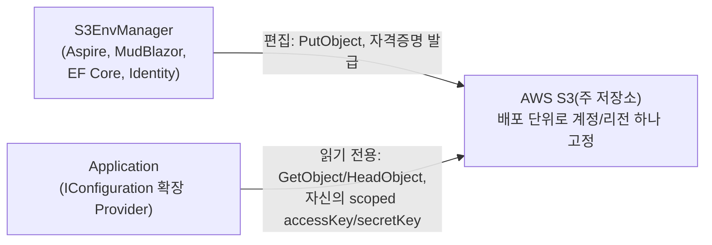

# S3EnvManager

Vault와 유사한 역할을 하는 Env 관리 서버. key=value(환경변수 스타일) Env를 웹 UI에서
편집하고 AWS S3에 저장한다. 각 Application은 S3EnvManager를 거치지 않고 자신에게 발급된
scoped AWS 자격증명으로 S3에 직접 접근해 값을 읽는다.

## 아키텍처


```mermaid
flowchart LR
    A["S3EnvManager<br/>(Aspire, MudBlazor,<br/>EF Core, Identity)"]
    B["AWS S3(주 저장소)<br/>배포 단위로 계정/리전 하나 고정"]
    C["Application<br/>(IConfiguration 확장 Provider)"]

    A -->|"편집: PutObject, 자격증명 발급"| B
    C -->|"읽기 전용: GetObject/HeadObject,<br/>자신의 scoped accessKey/secretKey"| B
```

- **S3EnvManager는 편집 전용**이다. Application은 S3EnvManager를 거치지 않고 스토리지에 직접
  접근한다 - S3EnvManager가 다운돼도 이미 떠 있는 Application에는 영향이 없다.
- **주 저장소는 항상 AWS S3다.** App 자격증명 발급과 암호화(AWS KMS)가 AWS IAM/KMS를 통해서만
  이뤄지기 때문에, S3 호환 임의 엔드포인트(MinIO 등)는 지원하지 않는다.
- 앱/환경 단위로 dotenv 스타일 번들을 오브젝트 하나로 저장한다(`{app}/{env}.env`). 환경은
  `dev`/`staging`/`product` 3종으로 고정. 히스토리/롤백은 S3 버킷 버저닝에 위임한다.

## 암호화 모델

오브젝트는 저장 전에 [sops](https://github.com/getsops/sops) 포맷으로 암호화해서 PutObject하고,
Application은 GetObject 후 직접 복호화한다 - 콘텐츠 자체가 암호문이므로 버킷 설정 실수나 퍼블릭
노출 사고가 나도 값이 그대로 유출되지 않는다. sops CLI 바이너리를 서브프로세스로 부르는 대신, sops
파일 포맷을 암호화/복호화 양쪽 다 순수 C#으로 재구현했다(`S3EnvManager.Sops`).

키 관리 백엔드는 AWS KMS를 쓰고(envelope encryption), **CMK를 용도별로 분리**한다:

- `primary` CMK — S3EnvManager 자신만 접근 가능(관리자급 권한: `GenerateDataKey`/`Encrypt`/`Decrypt`)
- `app-facing` CMK — Application은 `Decrypt`만 가능. Application의 KMS 자격증명이 통째로
  유출돼도 `primary` CMK 자체에는 접근할 수 없다.

같은 데이터 키를 두 CMK로 각각 감싸(다중 wrap) 트레일러에 나란히 기록하므로, 보안 경계는 두
겹이 된다 — **accessKey/secretKey의 스코프**(S3 오브젝트 접근 범위)와 **KMS 키 정책의
스코프**(복호화 가능 주체) 둘 다 뚫려야 평문이 노출된다.

CMK는 1~N개를 등록해두고 role(`admin`/`app`)별로 하나만 활성으로 지정하는 **레지스트리** 구조로
관리하며, 등록/승격/제거를 관리자가 화면에서 수행한다. 데이터 키 자체도 주기적으로 자동 로테이션된다.

### S3EnvManager 자신의 인증 상태 보호

ASP.NET Core Identity의 로그인 쿠키/antiforgery는 DataProtection 키링으로 보호되는데, 이 키를
Postgres에 영속화하는 것만으로는 DB 하나만 유출돼도 키가 평문으로 노출된다. KMS로 감싸는 방안은
순환 참조(그 열쇠 자체가 KMS를 열 자격증명을 보호하는 데도 쓰이므로)로 성립하지 않아, 자체 서명
인증서(X.509)로 감싼다. 인증서(PFX)는 DB에 append-only로 저장하되 비밀번호만 DB 밖(환경변수/
Aspire 시크릿 파라미터)에서 관리하고, 만료 전 자동으로 재시작 없이 다음 세대로 교체된다.

## Application 측 소비

`S3EnvManager.Configuration` NuGet 패키지가 `AddJsonFile`/`AddEnvironmentVariables`와 동일한
방식으로 쓸 수 있는 `IConfigurationSource`를 제공한다.

- `App__Setting=value` → 설정 키 `App:Setting`으로 변환(환경변수와 동일한 관례).
- 같은 Provider를 base/overwrite 두 오브젝트 키로 등록해 `S3 base 번들 → 로컬 env var → S3
  overwrite 번들` 3단 우선순위를 만든다(overwrite가 로컬 escape hatch보다도 우선하는 운영측
  강제 override).
- 폴링(HeadObject로 ETag 비교)으로 실행 중 변경을 감지해 `IOptionsMonitor<T>`/reload token으로
  반영한다. 일시적 장애 시 마지막 성공 값을 계속 서빙하고, 최초 부팅 시 스토리지가 죽어 있으면
  로컬에 캐싱해둔 암호문(평문이 아님)으로 폴백한다.

## CLI(스크립트에서 조회)

.NET `IConfiguration` provider를 쓸 수 없는 PowerShell 배포 스크립트 등을 위해
읽기 전용 조회 CLI(`S3EnvManager.Cli`)를 제공한다. Admin 복호화나 번들 쓰기는 지원하지
않는다 - 편집은 항상 Web UI(감사 로그가 남는 경로)에서만 한다.

```
s3envmanager get     --key <KEY> [--allow-missing] [--allow-missing-bundle]
s3envmanager get-all [--format json|dotenv] [--allow-missing-bundle]
s3envmanager --help | -h
s3envmanager --version | -v
```

`--bucket`/`--app`/`--env`/`--region`은 인자 또는 환경변수(`S3ENVMANAGER_BUCKET`/
`S3ENVMANAGER_APP_NAME`/`S3ENVMANAGER_ENV_SEGMENT`/`AWS_REGION`)로 지정한다.
`--bucket`은 S3 버킷 이름(예: `my-bucket`), `--env`는 `dev`/`staging`/`product` 중
하나, `--region`은 버킷/CMK가 있는 AWS 리전(예: `ap-northeast-2`)이다:

```bash
s3envmanager get-all --bucket my-bucket --app S3EnvManager --env product --region ap-northeast-2
```

AWS 자격증명은 SDK 기본 자격증명 체인을 따른다(`IamAppCredentialProvisioner`가 발급한,
`s3:GetObject`+`s3:ListBucket`(자기 prefix)+`kms:Decrypt`(app-facing CMK) 권한을
가진 자격증명이어야 한다 - 그래야 "번들 없음(exit 3)"과 "권한 없음(exit 2)"이 올바르게
구분된다). `get-all`은 base(`{app}/{env}.env`)와 overwrite(`{app}/{env}.overwrite.env`)
번들을 병합한 유효값을 반환한다.

v1의 1차 소비 경로는 이 레포를 로컬에서 빌드해 직접 호출하는 것이다(NuGet 피드 경유가
아니다 - GitHub Packages 인증/버전 프루닝 위험을 배포 크리티컬 패스에서 빼기 위함):

```bash
dotnet run --project S3EnvManager.Cli -- get-all --bucket <bucket> --app <app> --env <env>
```

`dotnet tool install --global S3EnvManager.Cli`(사람이 터미널에서 빠르게 값 하나
확인하고 싶을 때)도 가능하지만 부차 경로다.

종료 코드: `0`=성공, `1`=인자/설정 오류, `2`=AWS 인증/권한 오류, `3`=번들 자체가 없음,
`4`=복호화/무결성 실패(MAC 불일치, CMK 접근 불가, 트레일러 손상), `5`=`get`에서 지정한
키가 없음, `6`=그 외 AWS 호출 실패(5xx/스로틀링 등, 일시적일 수 있음), `7`=`get-all
--format dotenv`인데 값에 개행이 있어 표현 불가, `8`=위 어디에도 속하지 않는 처리되지
않은 예외(예상 못한 내부 오류 - `1`과 의미가 다르므로 재사용하지 않는다).

`get`의 `--allow-missing`은 번들 자체가 없는 경우도 함께 허용한다(호출자가 이미 "이 키에
값이 없어도 괜찮다"고 명시했으므로 번들 부재와 키 부재를 구분할 이유가 없다) - 번들 부재를
엄격히 막고 싶다면 `--allow-missing` 없이 호출한다.

## 프로젝트 구조

```
S3EnvManager.slnx
├── S3EnvManager.AppHost           (Aspire, 오케스트레이션 전용)
├── S3EnvManager.ServiceDefaults   (Aspire 관례, 서버 쪽에서만 사용)
├── S3EnvManager.Web               (MudBlazor, Identity, EF Core - 서버)
├── S3EnvManager.Web.Tests
├── S3EnvManager.Database          (EF Core - 서버)
├── S3EnvManager.MigrationService  (DB 마이그레이션 + Identity 시드 워커)
├── S3EnvManager.Sops              (NuGet 패키지 - sops 포맷 암/복호화 코덱)
├── S3EnvManager.Sops.Tests
├── S3EnvManager.Configuration     (NuGet 패키지 - IConfiguration Provider)
├── S3EnvManager.Configuration.SampleApp  (Configuration 패키지를 실제로 참조하는 샘플)
└── S3EnvManager.Cli               (읽기 전용 조회 CLI - get/get-all)
```

`S3EnvManager.Sops`/`S3EnvManager.Configuration`/`S3EnvManager.Cli`는 제3자 Application이
설치/실행하는 라이브러리·도구라 Aspire/MudBlazor/EF Core/Identity를 참조하지 않고, AppHost에도
등록하지 않는다.

## 시작하기

### 요구 사항

- .NET 10 SDK
- Docker(로컬 Postgres 컨테이너용, Aspire가 자동으로 띄운다)
- AWS 계정 (S3/IAM/KMS) — 로컬 개발도 실제 AWS를 대상으로 한다.

### 로컬 실행

```bash
dotnet run --project S3EnvManager.AppHost
```

최초 실행 전 Postgres 비밀번호를 user-secrets에 등록해야 한다(재기동 시 데이터 볼륨과 비밀번호가
어긋나지 않도록 고정값을 쓴다):

```bash
dotnet user-secrets set "Parameters:postgres-password" "<임의의 비밀번호>" --project S3EnvManager.AppHost
```

AWS 자격증명은 SDK 기본 자격증명 체인(환경변수, 공유 credentials 파일, 인스턴스 프로필 등)을
따른다. 앱 최초 기동 후 서버 로그에 초기 관리자 설정 토큰이 출력되며, 이 토큰으로 회원가입한
첫 사용자가 Administrator가 된다. 그 다음 `/settings/bootstrap` 화면에서 AWS 관리자 자격증명을
등록하면 이후 CMK/IAM 프로비저닝을 자동으로 진행할 수 있다.

DataProtection 키링을 인증서로 보호하려면(권장, 프로덕션에서는 사실상 필수) 아래 시크릿도
설정한다 — 비워두면 이 보호 없이 기존 동작(Postgres 영속화만)으로 실행된다.

```bash
dotnet user-secrets set "Parameters:dataprotection-cert-password" "<임의의 비밀번호>" --project S3EnvManager.AppHost
```

### 배포

`aspire publish -o docker-compose-artifacts`로 Docker Compose 배포 산출물을 생성할 수 있다.

### 테스트

```bash
dotnet test S3EnvManager.Web.Tests
dotnet test S3EnvManager.Sops.Tests
```

`*InfraTests.cs`로 끝나는 테스트는 실제 Postgres(`localhost:55432`)가 필요하다 — mocking
대신 실제 인프라로 검증하는 것을 원칙으로 한다.

> **테스트는 대상 DB를 파괴적으로 다룬다.** "role당 활성 CMK 하나" 같은 전역 전제를 만들려고
> `CmkRegistrations`/`DataKeyGenerations`/`AppCredentials`/`SharedSecrets` 등을 통째로
> 지우고, fake ARN을 가진 활성 CMK와 테스트 프로세스에서만 유효한 DataProtection 키로
> 암호화된 행을 남긴다(테스트는 시작 시점에만 정리한다). 그 상태로 앱을 띄우면 fake ARN으로
> 실제 KMS를 부르게 되어 정상 동작하지 않는다 — **개발용 DB와 테스트용 DB를 같이 쓰지 말 것.**

## 라이선스

[MIT](LICENSE)
